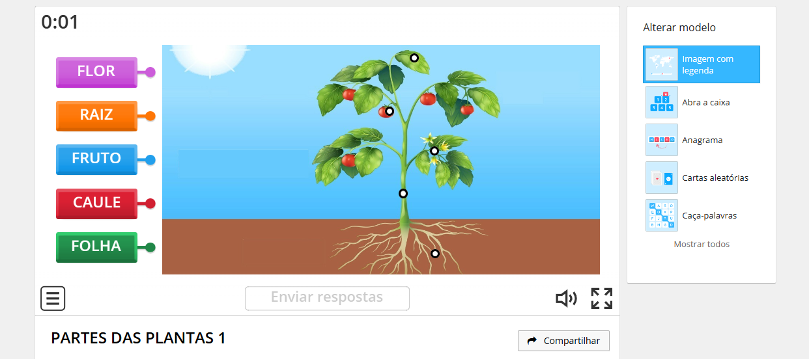
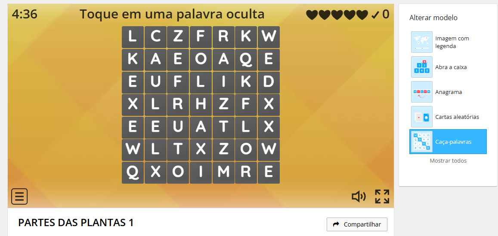
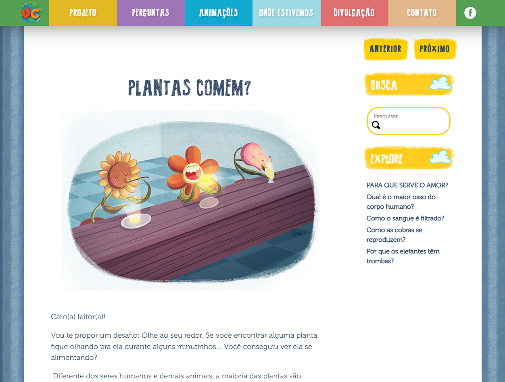
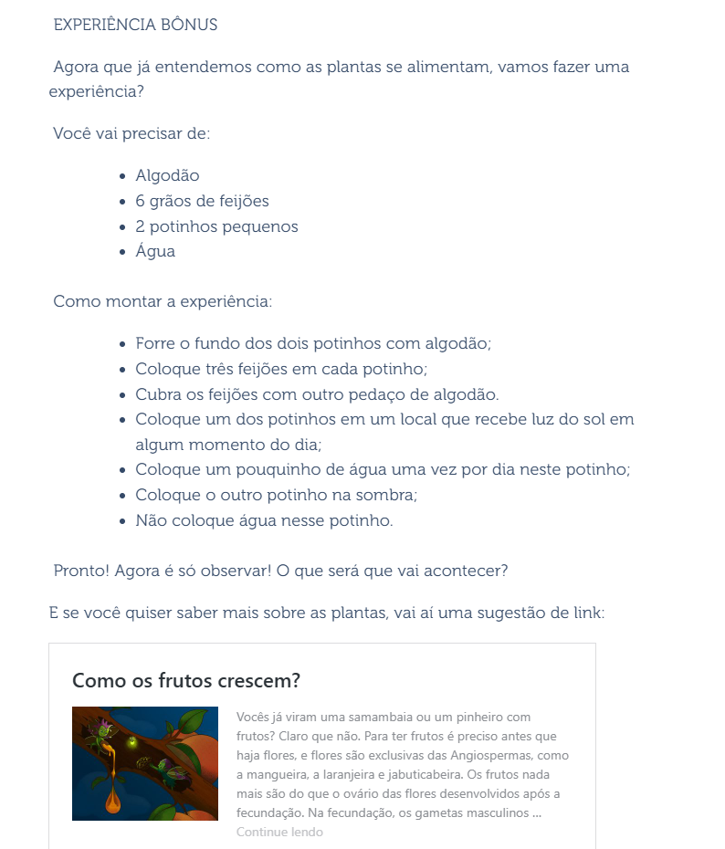
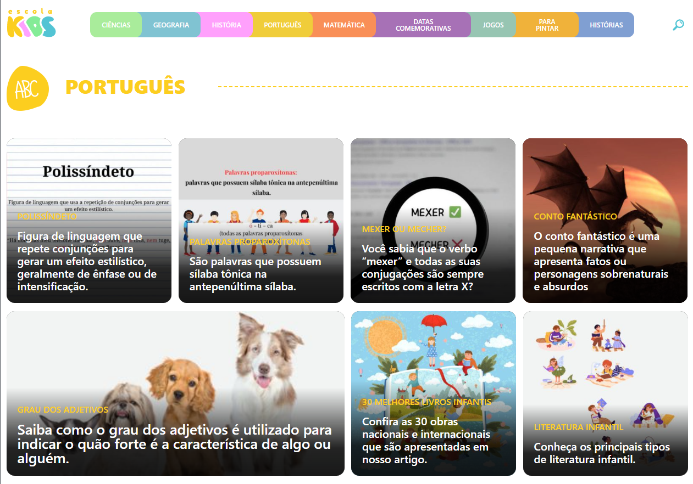
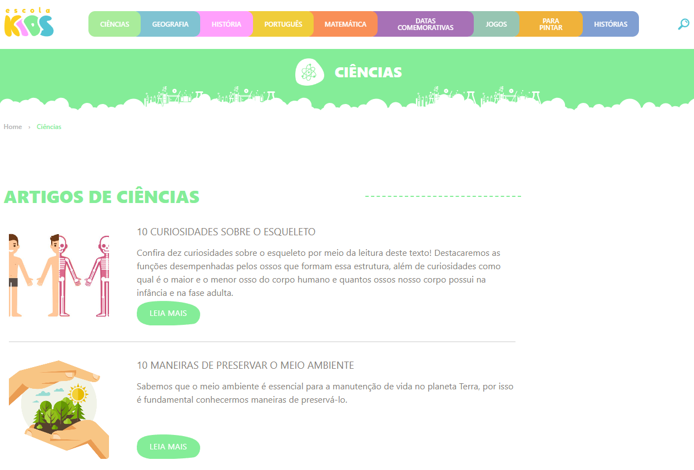
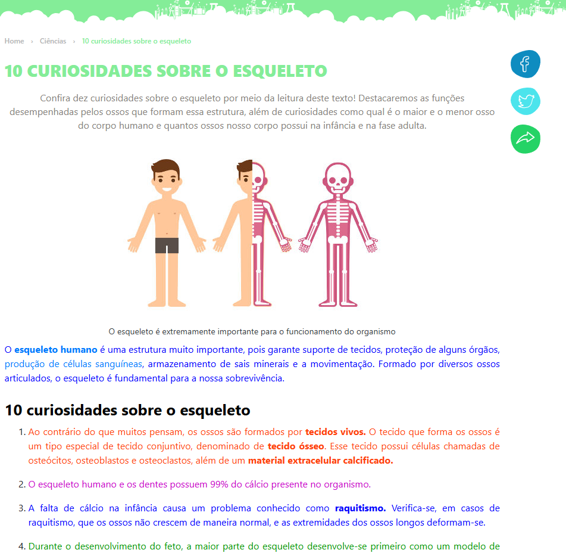

# Elicitação de requisitos

## Primeira elicitação de requisitos: Entrevistas

Para levantar os requisitos, foi feito um roteiro de entrevista, com foco nos pais, com as seguintes perguntas:

- Nome e idade
- O seu filho(a) já demonstrou interesse por plantar ou cuidar de plantas? Se sim, como foi a experiência?
- Quando você pensa em um site que ensina crianças a plantar, o que você considera mais importante? Que funcionalidades seriam úteis?
- Você acredita que o site deve ser mais voltado para diversão ou para o aprendizado? Como equilibrar esses dois aspectos?
- Como você imagina que o site pode apoiar a aprendizagem do seu filho(a) sobre a natureza e o plantio?
- O que seria importante para que o site fosse fácil de usar para seu filho(a)?   Elementos como navegação simples, botões grandes, cores e sons amigáveis, etc.
- Como seu filho(a) costuma interagir com a tecnologia?
- Que tipo de conteúdo interativo você acha que prenderia a atenção do seu filho(a)?   Minijogos, vídeos curtos, animações, tutoriais interativos?
- Você teria alguma preocupação sobre o uso desse site pelo seu filho(a)?  Segurança, tempo de tela, conteúdo inadequado, frustração com dificuldades tecnológicas?
- O quanto é importante para você que o site tenha controle parental ou algum tipo de supervisão?
- O que você acha de incluir elementos de recompensa no site, como medalhas virtuais ou pontos por completar etapas do plantio?
- Você imagina que o site seria usado como uma atividade educativa regular ou algo mais ocasional?
- Você gostaria de usar o site junto com seu filho(a), ou acredita que ele(a) poderia usá-lo sozinho(a)?
- O que você acha que seria um sinal de que o site está ajudando o seu filho(a) a aprender ou a se engajar com a jardinagem?
- Há mais alguma funcionalidade ou ideia que você acredita que seria útil para o site?
- Você gostaria de acrescentar algo mais sobre suas expectativas ou preocupações em relação a esse projeto?

As perguntas foram direcionadas à pais de crianças pois perguntas direcionados aos usuários finais da aplicação (as crianças) com certeza não seriam proveitosos. Portanto a próxima opção de pessoa a ser entrevistada teria que ser alguém com experiência em lidar com o público infantil. Outra opção de entrevistado seria de pessoas ligadas à área da educação, como professores, pedagogos ou instrutores de creche, por exemplo. Entretanto como achar este tipo de pessoa estava se provando se difícil o segundo grupo de pessoas foi recorrido para as entrevistas.

Outro fato importante a ser lembrado é o fato de que a ênfase foi muito mais direcionada à pessoas que se tornaram pais recentemente, visto que o perfil do público infantil mudou completamente nos últimos 15 anos, com celulares muito mais presentes no cotidiano. Logo, pessoas que foram pais nos anos 2000 ou antes provavelmente nunca tiveram que aprender a conciliar a infância de seus filhos com a tecnologia.

O modelo de entrevista utilizado foi o de funil, visto que como os integrantes do grupo não possuem um conhecimento tão aprofundado dos usuários finais, e como os entrevistados eram conhecidos não era necessário algo que fizesse eles se abrirem como o modelo de pirâmide

Por fim, segue o link da pasta do drive com as respostas resumidas que os entrevistados forneceram https://drive.google.com/drive/folders/1XInppAA4VIUCoehXpvkrzH9liDU-lfC1?usp=sharing

## Segunda elicitação de requisitos: Benchmarking

Também fizemos o *benchmarking* para a elicitação de requisitos, onde não encontramos necessariamente algum site com a mesma ideia, mas com intenções semelhantes ao ensino de crianças com relação ao plantio.

### **WordWall - Parte das Plantas**

O site WordWall tem como intuito a criação de recursos de ensino. Em nosso exemplo, temos como base um [conteúdo infantil sobre plantas](https://wordwall.net/pt/resource/3320857/partes-das-plantas-1) criado na plataforma WordWall, que pode ser visto abaixo.

A imagem acima se trata de um jogo simples em que você arrasta o nome de uma parte da planta até seu respectivo local na imagem. Durante o jogo existem diversos sons e efeitos visuais que ajudam na experiência do usuário, auxiliando nas conexões e ao fim do jogo avisam quando uma conexão foi correta ou errada. Além disso, no lado direito da tela existem modos de jogo alternativos, que exploram o mesmo conteúdo.

Um dos jogos alternativos é o caça palavras, em que a criança é estimulada a encontrar as palavras que elas utilizaram no jogo da imagem anterior, ou seja, raiz; caule; folha; flor; fruto.

#### Pontos Positivos

* Interface simples, com destaque no objetivo do jogo.
* Assitência visual e auditiva.
* Jogos alternativos para reforçar o aprendizado.

#### Pontos Negativos

* No primeiro jogo não está tão claro se as palavras pertencem ou não ao jogo devido as cores da interface.
* O jogo passa a ficar repetitivo após as primeiras tentativas.
* O conhecimento transmitido pelo jogo fica limitado a poucos elementos.

### Univeridade das crianças

Nesse [projeto](https://www.universidadedascriancas.fae.ufmg.br/perguntas/plantas-comem/) feito pela UFMG, vemos uma intenção parecida com a nossa, o ensino de crianças. O site tem uma interface e linguagem amigável para crianças, servindo de inspiração para o nosso aplicativo

Com nosso projeto em mente, as features que se destacaram foram:

* **Página referente as perguntas**

  Nesse site estão presentes uma série de perguntas feitas por crianças de várias idadades e cada uma das perguntas tem uma página única, na imagem acima podemos ver a página relacionada a "plantas comem?". Nessa página, é possível avançar ou retornar para outra pergunta, além disso é possível pesquisar outras dúvidas. 

* **Experimento correlato**

Além de todo conteúdo explicando de forma simples o porque plantas não comem e como elas absorvem energia, ao fim do texto temos um experimento detalhado que está relacionado ao conteúdo da pergunta. Nesse caso, esse experimento é o cultivo do feijão. Logo abaixo também temos um conteúdo relacionado ao conteúdo do texto e também do experimento, para reforçar ainda mais o aprendizado.

#### Pontos Positivos

* Artes bem elaboradas pensando em como se comunicar com o público alvo. Além disso as artes são únicas para cada pergunta.
* As partes interativas da interface estão bem nítidas e tem harmonia entre si e com o conteúdo educacional.
* Conteúdo do texto bem elaborado com o público alvo em mente

#### Pontos Negativos

* Pode ser difícil encontrar um conteúdo específico já que os conteúdos estão divididos em perguntas, uma alternativa seria dividir as perguntas por áreas do conhecimento.

### **Escola Kids**

A [plataforma](https://escolakids.uol.com.br/) Escola Kids é uma página que contém artigos de diversos assuntos(matérias), eles estão separados por área do conhecimento como pode ser visto na imagem abaixo.

As features que selecionamos para análise podem contribuir na organização de informações que pretendemos inserir em nosso projeto.

* **Página principal**

  Contem uma barra de opções que redireciona o usuário para área de interesse, além disso também há um icone de busca que possibilita procurar artigos com base na matéria. Outro detalhe que vale mencionar são os artigos anunciados na página principal, que podem te redirecionar diretamente para algum artigo de interesse.
* **Página de cada matéria**

  Após selecionar uma matéria de interesse na página principal, temos agora uma lista de todos artigos da respectiva matéria em ordem alfabética. Os artigos abrangem desde curiosidades, técnicas e explicação de conceitos complexos.

  
* **Página do artigo**

  É nesse ponto em que temos o conteúdo do artigo em si e, nesse quesito, assim como os outros sites, temos uma linguagem simples e apelativa ao público Infantojuvenil, que ajuda na transmissão do conhecimento. Diferente dos outros dois sites, aqui temos conteúdos mais complexos que abragem um público alvo maior, não se limitando apenas ao público infantil. Outra semelhança com o site anterior é com respeito a sugestão de conteúdo relacionado, em que são divulgados artigos semelhantes ao lido.

#### Pontos Positivos

* Os artigos variam entre conteúdos simples e complexos, o que abrange o público maior já que o conteúdo é útil não apenas para crianças.
* Separação de conteúdos por áreas do conhecimento. Esse ponto talvez não seja tão fácil relacionar com nosso projeto já que estaremos trabalhando dentro de apenas uma área do conhecimento, mas conforme formos aumentando o conteúdo relacionado a plantas pode ser interessante alguma forma de organização bem elaborada como esse site.
* Os artigos trazem também conhecimento por meio de curiosidades que instigam o leitor e o incentivam a conhecer mais sobre o assunto.

#### Pontos Negativos

* Como existem diversos artigos com diferentes níveis de ensino necessário, talvez seja interessante alguma forma de diferenciar o conteúdo por alguma métrica como dificuldade. Outra alternativa seria criar uma arvore do conhecimento para que o usuário consiga acompanhar seu progresso.
* Nos texto dos artigos em si há diferença de coloração entre diferentes linhas de texto, isso é algo que poderia ser otimizado para chamar mais atenção onde realmente é necessário.

## Requisitos

Com isso, os seguintes requisitos se provaram os mais essenciais para o funcionamento do projeto:

**Requisitos Funcionais**
- Exibir conteúdo sobre tipos de plantas, crescimento e funções das árvores, com vídeos curtos e animações. 
- Incluir recompensas (medalhas virtuais ou pontos) para motivar as crianças a completar etapas.
- Integrar um sistema de níveis ou conquistas para estimular o interesse contínuo sem excessos.
- Implementar navegação simplificada com botões grandes, cores atraentes, e sons amigáveis.
- Adaptar a experiência conforme as faixas etárias dos usuários.
- Adicionar conteúdos sobre biodiversidade, florestas e fauna para complementar o aprendizado sobre jardinagem.

**Requisitos não funcionais**
- Implementar recursos para proteção de dados e segurança de navegação.
- Garantir interface intuitiva com baixa complexidade para facilitar o uso tanto por crianças quanto por adultos.
- Suporte a dispositivos móveis e acessibilidade para crianças com diferentes habilidades tecnológicas.
- Otimizar o carregamento dos conteúdos, principalmente vídeos e animações, para um desempenho fluido em várias plataformas.
